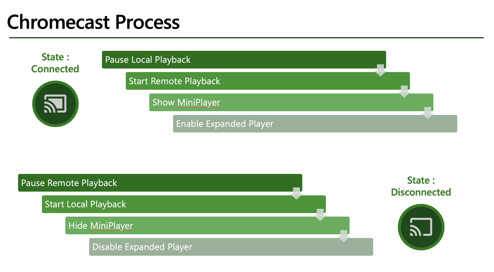

|  
|    | 

# Implementing Chromecast with Xamarin.Forms app
If you are creating a video or even audio app, you can add Chromecast Support for it pretty easily. If the video/audio browsing app is built using Xamarin.Forms, this post walks you through how to add the support for video Chromecast through 2 ways, using a Xamarin.Forms Page Renderer or via a embedded native page. Before we get started, there are a few initial steps to be taken. 

## Getting Started

There are 2 main components for a Cast App :

- A Sender Application : in this post, it will be our Xamarin App
- A Receiver Application : this is what hosts the video on the Chromecast Device. 

In this post, the sample is build similar to the Google Cast [Samples](https://developers.google.com/cast/docs/sample-apps), using the default Media Receiver with the default video support and styling. For more details on customizing the Receiver itself, you can check the Google Documentation [here](https://developers.google.com/cast/docs/web_receiver).

To create and setup the default Media Receiver, the steps are very clearly explained in the Google Cast Guide [here](https://developers.google.com/cast/docs/registration). If you choose not to publish the receiver application, be sure to follow the guide to setup a device for development so you can debug the receiver application. Once the steps are completed, make a note of the Application ID, this is all we need to setup the Xamarin app to connect with the receiver.

## Setup for Sender App  

The Google Chromecast Framework is provided to us as nugets maintained by the Xamarin team, there is no need to create any Binding project for it. Only caveat being, these frameworks are native to each platform, there is no cross platform Xamarin.Forms implementation for it yet. In this post, we'll see two different ways to implement support into a Xamarin.Forms app. 

- Xamarin.Android [nuget](https://www.nuget.org/packages/Xamarin.GooglePlayServices.Cast/) and [source](https://github.com/xamarin/GooglePlayServicesComponents)
- Xamarin.iOS [nuget](https://www.nuget.org/packages/Xamarin.Google.iOS.Cast/) and [source](https://github.com/xamarin/GoogleApisForiOSComponents/tree/main/source/Google/Cast)

## Develop Sender App 

The Chromecast framework is developed to work with the Native Video Players or with any other third party Video Player Control. Integrating the Cast into the app invovles adding three main UI compoonents and adding Session Management between the video player and Cast Framework. The UI compoonents are: the Cast button, the Mini Player and the Expanded Player. Each of these controls are a part of the framework with default styling and can be customized as needed. For session management, the based on the Cast Connection state, the system uses the Video Player session management and the Cast Session Management to control app behavior and state of the UI components.

## It Works

**ANDROID**

**IOS**

